<!--
  This is your PROFILE README. It goes in a repo named exactly after your
  username (e.g. github.com/dineshyadav03/dineshyadav03) so GitHub shows it on your profile.
  Widths 370/490 keep the portrait and info card the same height.
-->

<table>
<tr>
<td valign="top"></td>
<td valign="top"></td>
</tr>
</table>

## Dinesh Yadav

**AI • LLMs • Agents • Computer Vision • Robotics • AEC**

*Building scalable AI products, open-source tools, and real-world systems.*

 

<!-- animated contribution graph, refreshed daily by the workflow -->

